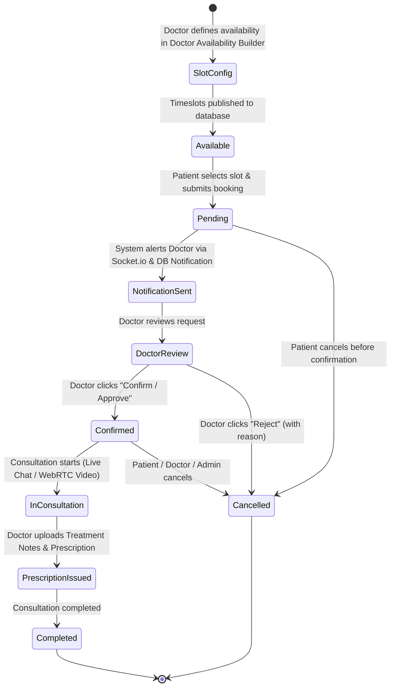

# 🏥 RemedyEase — Modern Telehealth & Healthcare Management Platform

[](https://remedy-ease-new.vercel.app)
[](https://react.dev/)
[](https://nodejs.org/)
[](https://www.mongodb.com/)
[](https://webrtc.org/)
[](LICENSE)

> **RemedyEase** is a comprehensive, production-grade digital healthcare and telemedicine platform engineered to streamline interactions between **Patients**, **Licensed Medical Practitioners**, and **Healthcare Administrators**. Built with high availability, end-to-end clinical workflows, peer-to-peer HD video consultations, interactive multilingual AI health triage, real-time messaging, digital prescription dispatch, and an integrated medical pharmacy store.

---

## 📌 Table of Contents

1. [Executive Summary](#-executive-summary)
2. [Key Portals & Features](#-key-portals--features)
   - [👤 Patient Portal](#-patient-portal)
   - [👨‍⚕️ Doctor Portal](#️-doctor-portal)
   - [🛡️ Admin Portal](#️-admin-portal)
3. [🤖 AI-Powered Healthcare & Clinical Decision Support](#-ai-powered-healthcare--clinical-decision-support)
4. [📅 Appointment Lifecycle & Dynamic Slot Scheduling](#-appointment-lifecycle--dynamic-slot-scheduling)
5. [📡 Real-Time Communication (WebRTC & WebSockets)](#-real-time-communication-webrtc--websockets)
6. [🔒 Security, Compliance & System Hardening](#-security-compliance--system-hardening)
7. [🛠️ Tech Stack Matrix](#️-tech-stack-matrix)
8. [🏛️ System Architecture](#️-system-architecture)
9. [📂 Repository Structure](#-repository-structure)
10. [🚀 Local Development & Setup](#-local-development--setup)
11. [🔐 Environment Variables Guide](#-environment-variables-guide)
12. [📄 License](#-license)

---

## 🌟 Executive Summary

Traditional outpatient healthcare faces significant hurdles: fragmented communication channels, geographic barriers to specialized care, scheduling friction, and delays in prescription fulfillment.

**RemedyEase** bridges this gap by unifying the modern clinical journey into a single, responsive ecosystem:
- **Patients** discover verified doctors, view real-time availability slots, book consultations, engage in encrypted HD video and text chats, receive digital prescriptions, and order medications.
- **Doctors** maintain an active digital practice, define custom practice schedules, review patient medical histories, manage appointment requests, conduct clinical consultations with AI-assisted diagnosis summaries, and generate verified prescriptions.
- **Administrators** verify medical credentials, review pending doctor applications with automated email notifications, monitor platform-wide consultation metrics, and manage user compliance.

---

## 🚀 Key Portals & Features

```
                                  ┌──────────────────┐
                                  │   RemedyEase     │
                                  │  Unified Platform│
                                  └────────┬─────────┘
                   ┌───────────────────────┼───────────────────────┐
                   ▼                       ▼                       ▼
        ┌─────────────────────┐ ┌─────────────────────┐ ┌─────────────────────┐
        │   Patient Portal    │ │    Doctor Portal    │ │    Admin Portal     │
        ├─────────────────────┤ ├─────────────────────┤ ├─────────────────────┤
        │ • Doctor Discovery  │ │ • Practice Console  │ │ • Doctor Credential │
        │ • Slot Booking      │ │ • Custom Timeslots  │ │   Approval System   │
        │ • WebRTC Video Call │ │ • WebRTC Video Call │ │ • User / Doctor RBAC│
        │ • Real-time Chat    │ │ • Real-time Chat    │ │ • Platform Metrics  │
        │ • AI Symptom Triage │ │ • AI Clinical Engine│ │ • Global Audit Log  │
        │ • Pharmacy Store    │ │ • Rx Upload Engine  │ │ • Consultation Mon. │
        └─────────────────────┘ └─────────────────────┘ └─────────────────────┘
```

### 👤 Patient Portal

* **Account & Identity Management**: Secure registration with avatar uploads (via Cloudinary), password hashing (Bcrypt), and persistent JWT session handling.
* **Specialist Discovery**: Search and filter verified doctors by specialty, qualification, experience, consultation fee, and clinical ratings.
* **Doctor-Synchronized Booking**: Live date and time picker that strictly pulls doctor-published availability slots, preventing double-bookings.
* **Appointment Tracking**: Live dashboard displaying pending, confirmed, completed, and cancelled consultation statuses with real-time updates.
* **Interactive Symptom Checker**: Multi-step conversational triage engine with voice recognition (12 languages) that screens symptoms and recommends appropriate clinical specialists.
* **AI Everyday Health Insights**: Curated lifestyle guidance, home remedies, contraindication warnings, and bookmarking features for self-care.
* **Live In-Consultation Chat**: Instant two-way messaging with typing indicators, timestamps, message read receipts, and consultation context.
* **HD Video Consultation**: Low-latency peer-to-peer WebRTC video calls with in-room mute, video toggle, screen sharing, grid/focus layout modes, call timer, and connection health diagnostics.
* **Digital Prescription Viewer**: Direct access to view and download doctor-uploaded prescriptions (PDF/Image) tied directly to consultation records.
* **Integrated Medical Store**: Browse medicine catalog by category (Pain Relief, Antibiotics, Allergy, Digestive, etc.), filter by price range and brand alternatives, choose multi-day supply packages (15, 30, 45, 60 days), and place orders with checkout tracking.

---

### 👨‍⚕️ Doctor Portal

* **Practitioner Authentication & Verification**: Dedicated doctor onboarding with automated credential verification workflows (Medical License, Specialization, Experience, Qualifications).
* **Application Approval Guard**: Unapproved or pending doctor accounts are securely prevented from clinical operations until administrator verification.
* **Dynamic Availability Builder**: Intuitive timeslot builder allowing doctors to publish recurring or custom 30-minute availability intervals for any future date.
* **Clinical Dashboard**: Real-time overview of today's schedule, incoming appointment requests, total consultations, and active patient inquiries.
* **Appointment Management**: One-click workflow to **Confirm / Approve** or **Reject / Cancel** (with recorded clinical rationale) appointment requests.
* **Patient Medical History**: Longitudinal timeline view of patient past appointments, reported symptoms, clinical summaries, and previous prescriptions.
* **AI Clinical Assistant**: Decision-support tool that analyzes reported patient symptoms and medical history against Groq-powered LLMs (Llama 3.3 70B / Llama 3.1 8B) to suggest ranked differential diagnoses, recommended laboratory tests, and medication risk alerts.
* **Prescription Dispatch Engine**: Upload digital prescriptions and treatment notes directly to Cloudinary, instantly attaching them to the patient's verified record.
* **Real-time Consultation Console**: Integrated WebSockets & WebRTC suite with automated patient arrival notifications and consultation switching.

---

### 🛡️ Admin Portal

* **Restricted Super Admin Authentication**: Single-tenant administrative gateway secured by email validation, Bcrypt password verification, and JWT privileges.
* **Doctor Credential Verification Engine**: Review applicant profiles, credentials, bio, and medical documents; trigger instant **Approve** or **Reject** decisions.
* **Automated Practitioner Email Notifications**: Direct Nodemailer SMTP integration dispatching branded HTML emails informing doctors of account approval or rejection.
* **User & Patient Management**: Searchable directory of registered patients with profile inspection and instant **Block / Unblock** security controls.
* **Doctor Directory Governance**: Platform-wide monitoring of registered practitioners, clinical status, and access suspension tools.
* **Global Appointment Oversight**: Complete audit log of all platform consultations with administrative cancellation capabilities for disputed bookings.
* **Prescription Audit Trail**: Centralized repository of all uploaded prescriptions, ensuring compliance and platform record fidelity.
* **Platform Health & Metrics**: Live analytics reporting total registered patients, verified doctors, pending applications, active appointments, and prescriptions issued.

---

## 🤖 AI-Powered Healthcare & Clinical Decision Support

RemedyEase incorporates artificial intelligence designed exclusively to provide **informational health insights** and **clinical decision support**.

> [!IMPORTANT]
> **Clinical Safety & Legal Disclaimer:**
> The AI features in RemedyEase are strictly decision-support and educational tools. They **do not** replace professional medical judgment, provide definitive diagnoses, or prescribe medication. In potential emergency situations, the system immediately directs users to local emergency medical services.

```
                          ┌───────────────────────────┐
                          │   Patient / Doctor Input  │
                          └─────────────┬─────────────┘
                                        │
                                        ▼
                          ┌───────────────────────────┐
                          │ Emergency Red-Flag Filter │
                          └─────────────┬─────────────┘
                                        │
                      ┌─────────────────┴─────────────────┐
           [Emergency Detected]                [Standard Triage]
                      ▼                                   ▼
        ┌───────────────────────────┐       ┌───────────────────────────┐
        │ Instant High-Urgency Alert│       │  Multi-Model Groq LLM API │
        │ (Prompt Emergency Care)   │       │ (Llama-3.3-70B / 3.1-8B)  │
        └───────────────────────────┘       └─────────────┬─────────────┘
                                                          │
                                                [API Timeout/Offline]
                                                          ▼
                                            ┌───────────────────────────┐
                                            │ Local Rule-Based Clinical │
                                            │ Fallback Knowledge Engine │
                                            └───────────────────────────┘
```

### 1. Multi-Step Conversational Symptom Checker
- **Voice & Speech Input**: Integrated Web Speech API supporting real-time voice dictation in **12 languages and dialects** (English, Hindi, Hinglish, Punjabi, Bengali, Marathi, Tamil, Telugu, Gujarati, Kannada, Malayalam, Urdu).
- **Red-Flag Screening**: Hardcoded pattern recognition for critical emergencies (acute chest pain, stroke signs, respiratory distress, severe hemorrhage, poisoning) triggering immediate emergency guidance.
- **Triage Leveling**: Categorizes inputs into *Routine*, *Urgent*, or *Emergency* recommendations with suggestions for matching clinical specialties (e.g., Cardiologist, Dermatologist, Neurologist).

### 2. Multi-Model Resilience Engine
- Connected to **Groq Cloud API** leveraging high-speed inference on `llama-3.3-70b-versatile`, `llama-3.1-8b-instant`, `mixtral-8x7b-32768`, and `gemma2-9b-it`.
- **Zero-Downtime Offline Clinical Fallback**: If external AI services experience rate limits or network latency, an internal knowledge-base algorithm activates automatically, ensuring patient triage continuity.

### 3. Doctor Clinical Diagnostic Assistant
- Practitioners can input complex symptom clusters and medical histories to generate structured clinical overviews:
  - Ranked differential diagnoses with confidence indicators.
  - Recommended laboratory investigations (e.g., CBC, Serum Electrolytes, Plain Radiography).
  - Potential contraindications and medication allergy cross-checks.

---

## 📅 Appointment Lifecycle & Dynamic Slot Scheduling

RemedyEase enforces a structured appointment lifecycle ensuring doctors retain full control over their clinical calendars while preventing scheduling conflicts.



1. **Doctor Availability Definition**: Doctor opens the *Availability* console, chooses dates, and selects from 30-minute standard intervals (`09:00 AM - 09:30 AM`, `02:00 PM - 02:30 PM`, etc.) or custom intervals.
2. **Synchronized Patient Booking**: The patient views doctor profiles on *Meet Doctor*; the system only exposes available, unbooked slots for that specific date.
3. **Real-time Notification**: When booked, a `pending` record is created, and the doctor is notified instantly via WebSocket events and the in-app notification center.
4. **Doctor Decision**: The doctor confirms or rejects the appointment from their dashboard. Status changes update across both portals in real time.
5. **Post-Consultation Prescription**: Following the call or chat session, the doctor attaches clinical observations and uploaded prescriptions, immediately visible on the patient's dashboard.

---

## 📡 Real-Time Communication (WebRTC & WebSockets)

RemedyEase features a custom real-time communication stack powered by **Socket.io** and **Peer-to-Peer WebRTC**.

```
  [ Patient Browser ]                                   [ Doctor Browser ]
          │                                                     │
          │ 1. Connect & Register (socket.id, userId)           │
          ├─────────────────────────┐ ┌─────────────────────────┤
          │                         ▼ ▼                         │
          │               ┌─────────────────────┐               │
          │               │  Socket.io Server   │               │
          │               │ (Bckend_for_Doctor) │               │
          │               └──────────┬──────────┘               │
          │                          │                          │
          │ 2. WebRTC Signaling (Offer / Answer / ICE)          │
          │◄─────────────────────────┴─────────────────────────►│
          │                                                     │
          │ 3. P2P Encrypted Audio / Video Stream (STUN NAT)    │
          │◄═══════════════════════════════════════════════════►│
          │                                                     │
          │ 4. Live Chat Messages & Typing State                │
          │◄───────────────────────────────────────────────────►│
```

### Technical Highlights:
* **Appointment-Scoped Rooms**: Clients join unique WebSocket rooms (`chatRoomId`, `callRoomId`, `appointment_<id>`) ensuring complete isolation of medical conversations.
* **WebRTC Mesh Signaling**: Full SDP Offer/Answer negotiation and ICE Candidate discovery routed via Google STUN servers (`stun:stun.l.google.com:19302`).
* **Media Stream Control**: Native controls for microphone mute/unmute, camera enable/disable, dynamic screen sharing via `navigator.mediaDevices.getDisplayMedia`, and active participant layout toggles (Auto, Grid, Focus).
* **Live Connection Diagnostics**: Real-time visual status badges (`connecting`, `connected`, `reconnecting`, `failed`) and in-call session timers.
* **Context Switching**: One-click smooth transition between live video consultation and clinical chat without dropping room state.

---

## 🔒 Security, Compliance & System Hardening

Security and patient confidentiality are top priorities in RemedyEase's architecture:

| Security Vector | Implementation Detail |
| :--- | :--- |
| **Authentication** | JSON Web Tokens (JWT) with HMAC-SHA256 signatures, configurable secret rotation, and fallback mechanisms. |
| **Password Security** | Bcrypt / BcryptJS cryptographic hashing with 10 salt rounds before persistence. |
| **Role-Based Access Control (RBAC)** | Strict isolation between `Patient`, `Doctor`, and `Admin` permissions across middleware and routes. |
| **Super Admin Privilege Guard** | Strict administrative email whitelist and isolated Admin collection prevent unauthorized privilege escalation. |
| **Doctor Application Guard** | Unapproved / Pending / Rejected doctors are barred from logging in or executing clinical actions. |
| **Account Suspension** | Instant `isBlocked` middleware checks immediately terminate access for suspended accounts. |
| **IDOR / BOLA Protection** | `verifyAppointmentParticipant` verifies that callers are the assigned doctor, patient, or admin before accessing consultation records or prescriptions. |
| **Input Sanitization** | Automatic HTML stripping and length bounding across user inputs, symptom checker queries, and chat messages to mitigate XSS and injection attacks. |
| **Cloudinary File Shielding** | Avatars and prescriptions are processed in-memory via Multer memory buffers and sent directly to Cloudinary without storing unencrypted files on the server disk. |
| **CORS & Origin Isolation** | Configured CORS whitelist allowing only authorized client origins to communicate with backends. |

---

## 🛠️ Tech Stack Matrix

### Frontend Ecosystem
| Category | Technology | Purpose |
| :--- | :--- | :--- |
| **Core Framework** | React 19.1.1 | Reactive component hierarchy and state management |
| **Build & Dev Server** | Vite 7.1.7 | Sub-second HMR and production asset bundling |
| **Routing** | React Router DOM 7.8.2 | Multi-portal client-side routing & navigation guards |
| **Icons & Design Tokens**| React Icons 5.5.0 (Feather / Lucide) | Consistent iconography across clinical dashboards |
| **Real-time Client** | Socket.io Client 4.8.1 | WebSocket communication for live chat and WebRTC |
| **3D Graphics** | Three.js & React Three Fiber / Drei | Interactive 3D visualization on user landing pages |
| **Notifications** | React Toastify 11.0.5 | Toast notification alerts for clinical events |
| **Styling** | Vanilla CSS + PostCSS | Custom responsive design system with dark & light palettes |

### Backend Ecosystem
| Category | Technology | Purpose |
| :--- | :--- | :--- |
| **Runtime Environment** | Node.js (ES Modules) | High-concurrency server runtime |
| **Web Framework** | Express 4.18.2 | RESTful API routing, error handling, and middleware |
| **Database & ODM** | MongoDB with Mongoose 8.0.0 | NoSQL database with strict schema validation |
| **Real-time Server** | Socket.io 4.7.2 | Server-side room management and WebRTC signaling |
| **AI Inference** | Groq Cloud API (`axios`) | High-speed LLM inference (Llama 3.3 70B, Llama 3.1 8B) |
| **Media & File Storage** | Cloudinary & Multer & Streamifier | Secure cloud storage for medical prescriptions and avatars |
| **Email Service** | Nodemailer 6.10.1 | Automated transactional emails for doctor verification |
| **Security & Auth** | JSONWebToken & Bcrypt | Token issuance, verification, and password hashing |

---

## 🏛️ System Architecture

```
                                  ┌───────────────────────────┐
                                  │      Client Browsers      │
                                  │ (Patient / Doctor / Admin)│
                                  └─────────────┬─────────────┘
                                                │
                                HTTPS / WSS     │
                                                ▼
                        ┌──────────────────────────────────────────────┐
                        │              Frontend Web App                │
                        │           (Vite + React 19 SPA)              │
                        └───────┬──────────────────────────────┬───────┘
                                │                              │
          REST Requests (Port 8000)                  REST & Sockets (Port 5001)
                                │                              │
                                ▼                              ▼
        ┌──────────────────────────────┐       ┌──────────────────────────────┐
        │      Main User Backend       │       │    Doctor & Telehealth Svc   │
        │  (Auth, Orders, Admin, AI)   │       │ (Appointments, Live, WebRTC) │
        └───────┬──────────────┬───────┘       └───────┬──────────────┬───────┘
                │              │                       │              │
                ▼              ▼                       ▼              ▼
        ┌──────────────┐┌──────────────┐       ┌──────────────┐┌──────────────┐
        │   MongoDB    ││   Groq AI    │       │   MongoDB    ││  Cloudinary  │
        │ Main Database││  Cloud LLM   │       │ Doctor/Appts ││ Media Storage│
        └──────────────┘└──────────────┘       └──────────────┘└──────────────┘
```

---

## 📂 Repository Structure

```text
RemedyEase_New/
├── ALL_FILES/
│   ├── Backend/                                # Main User & Administrative Backend (Port 8000)
│   │   ├── src/
│   │   │   ├── controllers/
│   │   │   │   ├── admin.controller.js         # User, doctor & platform administration
│   │   │   │   ├── Ai.controller.js            # Symptom analysis & Groq LLM integration
│   │   │   │   ├── Order.controllers.js        # Medical store cart & checkout management
│   │   │   │   └── user.controller.js          # Patient registration, auth & profile
│   │   │   ├── db/
│   │   │   │   └── index.js                    # MongoDB connection lifecycle
│   │   │   ├── middleware/
│   │   │   │   ├── auth.middleware.js          # verifyUser, verifyAdmin & optionalUserAuth
│   │   │   │   └── multer.middleware.js        # In-memory file buffer processing
│   │   │   ├── models/
│   │   │   │   ├── Admin.models.js             # Super Admin schema & validator
│   │   │   │   ├── Appointment.models.js       # Appointment schema
│   │   │   │   ├── Medicine.models.js          # Pharmacy inventory schema
│   │   │   │   ├── Order.models.js             # Pharmacy orders schema
│   │   │   │   └── User.models.js              # Patient identity schema
│   │   │   ├── routes/                         # Express route definitions
│   │   │   │   ├── admin.routes.js
│   │   │   │   ├── Ai.routes.js
│   │   │   │   ├── Order.routes.js
│   │   │   │   └── user.routes.js
│   │   │   ├── app.js                          # Express application configuration
│   │   │   └── index.js                        # User backend entry point
│   │   └── package.json
│   │
│   ├── Bckend_for_Doctor/                      # Doctor Practice & Telehealth Backend (Port 5001)
│   │   ├── src/
│   │   │   ├── controllers/
│   │   │   │   ├── Admin.controllers.js        # Doctor approvals & admin statistics
│   │   │   │   ├── Ai.controller.js            # Doctor diagnostic suggestion engine
│   │   │   │   ├── Appointment.controllers.js  # Booking, confirmation, rejection & Rx
│   │   │   │   ├── Doctor.controllers.js       # Doctor auth, timeslots & profile
│   │   │   │   └── LiveFeatures.controllers.js # Chat history & notifications
│   │   │   ├── middleware/
│   │   │   │   └── auth.middleware.js          # verifyDoctor & verifyAppointmentParticipant
│   │   │   ├── models/
│   │   │   │   ├── Appointments.models.js      # Complete clinical appointment schema
│   │   │   │   ├── ChatMessage.models.js       # In-consultation messages schema
│   │   │   │   ├── Doctor.models.js            # Verified doctor schema
│   │   │   │   ├── Notification.models.js      # Real-time alert notifications schema
│   │   │   │   └── Timeslot.models.js          # Doctor availability slots schema
│   │   │   ├── routes/
│   │   │   │   ├── Admin.routes.js
│   │   │   │   ├── Ai.routes.js
│   │   │   │   ├── Appointment.routes.js
│   │   │   │   ├── Doctor.routes.js
│   │   │   │   └── LiveFeatures.routes.js
│   │   │   ├── utils/
│   │   │   │   └── email.js                    # Nodemailer approval/rejection templates
│   │   │   ├── app.js                          # Express app configuration
│   │   │   └── index.js                        # Doctor server & Socket.io WebRTC signaling
│   │   └── package.json
│   │
│   └── RemedyEase/                             # React 19 SPA Frontend
│       ├── src/
│       │   ├── components/
│       │   │   ├── AdminAppointments.jsx       # Admin appointments management view
│       │   │   ├── AdminOverview.jsx           # Admin platform metrics overview
│       │   │   ├── AdminPrescriptions.jsx      # Admin global prescriptions browser
│       │   │   ├── ChangeAdminPassword.jsx     # Admin security settings
│       │   │   ├── DoctorDashBoardNav.jsx      # Doctor portal header navigation
│       │   │   ├── DoctorsManagement.jsx       # Doctor directory & block management
│       │   │   ├── ErrorBoundary.jsx           # React UI crash isolation boundary
│       │   │   ├── Healthcare3D.jsx            # 3D interactive hero visualization
│       │   │   ├── LiveChat.jsx                # Clinical real-time chat component
│       │   │   ├── PendingDoctors.jsx          # Doctor verification & approval console
│       │   │   ├── PrescriptionUpload.jsx      # Doctor Rx file upload modal
│       │   │   ├── PrescriptionView.jsx        # Patient Rx inspection modal
│       │   │   ├── UserDashBoardNav.jsx        # Patient portal navigation
│       │   │   ├── UsersManagement.jsx         # Patient account management view
│       │   │   └── VideoCall.jsx               # Peer-to-peer WebRTC consultation suite
│       │   ├── pages/
│       │   │   ├── Doctor_DashBoardComponents/ # Doctor portal views (Home, Appointments, Chat, etc.)
│       │   │   ├── Doctor_Data_Pages/          # Doctor onboarding (Login, Signup, About)
│       │   │   ├── User_DashBoardComponents/   # Patient portal views (Home, Store, Symptoms, AI)
│       │   │   ├── User_Data_Pages/            # Patient landing & auth views
│       │   │   ├── AdminDashboard.jsx          # Super Admin parent workspace
│       │   │   ├── AdminLogin.jsx              # Secured Admin authentication
│       │   │   ├── DoctorDashboard.jsx         # Doctor parent workspace & routing
│       │   │   ├── LandingPage.jsx             # Public gateway landing page
│       │   │   └── UserDashboard.jsx           # Patient parent workspace & routing
│       │   ├── App.jsx                         # Main React application routing
│       │   └── main.jsx                        # React root mount
│       ├── package.json
│       └── vite.config.js
│
├── ADMIN_SECURITY.md                           # Comprehensive Admin Security specification
├── LICENSE                                     # MIT License
└── README.md                                   # Project documentation
```

---

## 🚀 Local Development & Setup

### Prerequisites
- **Node.js**: v18.0.0 or higher
- **MongoDB**: Local instance running on port `27017` or a MongoDB Atlas URI
- **Git**: Installed and configured

### 1. Clone Repository
```bash
git clone https://github.com/ramit8508/RemedyEase_New.git
cd RemedyEase_New
```

### 2. Configure Environment Files
Set up `.env` files in both backend directories following the [Environment Guide](#-environment-variables-guide).

### 3. Install Dependencies & Start Services

#### Terminal 1 — Main Backend (Port 8000)
```bash
cd ALL_FILES/Backend
npm install
npm run dev
```

#### Terminal 2 — Doctor & Telehealth Backend (Port 5001)
```bash
cd ALL_FILES/Bckend_for_Doctor
npm install
npm run dev
```

#### Terminal 3 — Frontend Application (Port 5173)
```bash
cd ALL_FILES/RemedyEase
npm install
npm run dev
```

Open [http://localhost:5173](http://localhost:5173) in your browser.

---

## 🔐 Environment Variables Guide

> [!CAUTION]
> Never commit actual credentials, private keys, or database connection strings to public version control.

### `ALL_FILES/Backend/.env`
```env
PORT=8000
MONGO_URL=mongodb://localhost:27017/remedyease_main
CORS_ORIGIN=http://localhost:5173
ACCESS_TOKEN_SECRET=your_jwt_access_token_secret_key
REFRESH_TOKEN_SECRET=your_jwt_refresh_token_secret_key
ACCESS_TOKEN_EXPIRY=1d
REFRESH_TOKEN_EXPIRY=10d

# Groq Cloud AI
GROQ_API_KEY=your_groq_api_key

# Cloudinary Storage
CLOUDINARY_CLOUD_NAME=your_cloudinary_cloud_name
CLOUDINARY_API_KEY=your_cloudinary_api_key
CLOUDINARY_API_SECRET=your_cloudinary_api_secret

# Inter-Service URL
DOCTOR_BACKEND_URL=http://localhost:5001
AUTHORIZED_ADMIN_EMAIL=ramitgoyal1987@gmail.com
```

### `ALL_FILES/Bckend_for_Doctor/.env`
```env
PORT=5001
MONGO_URL=mongodb://localhost:27017/remedyease_doctor
CORS_ORIGIN=http://localhost:5173
ACCESS_TOKEN_SECRET=your_doctor_jwt_access_token_secret_key
REFRESH_TOKEN_SECRET=your_doctor_jwt_refresh_token_secret_key
ACCESS_TOKEN_EXPIRY=1d
REFRESH_TOKEN_EXPIRY=10d

# Email Transporter for Doctor Approvals
EMAIL_USER=your_smtp_email@gmail.com
EMAIL_PASS=your_smtp_app_password

# Cloudinary Storage
CLOUDINARY_CLOUD_NAME=your_cloudinary_cloud_name
CLOUDINARY_API_KEY=your_cloudinary_api_key
CLOUDINARY_API_SECRET=your_cloudinary_api_secret

# Groq Cloud AI
GROQ_API_KEY=your_groq_api_key

AUTHORIZED_ADMIN_EMAIL=ramitgoyal1987@gmail.com
```

### `ALL_FILES/RemedyEase/.env`
```env
VITE_BACKEND_URL=http://localhost:8000
VITE_DOCTOR_BACKEND_URL=http://localhost:5001
```

---

## 📄 License

Distributed under the **MIT License**. See [`LICENSE`](LICENSE) for complete details.

---

<div align="center">
  <sub>Built with ❤️ by <a href="https://github.com/ramit8508">Ramit Goyal</a> • Designed for modern, accessible healthcare.</sub>
</div>
